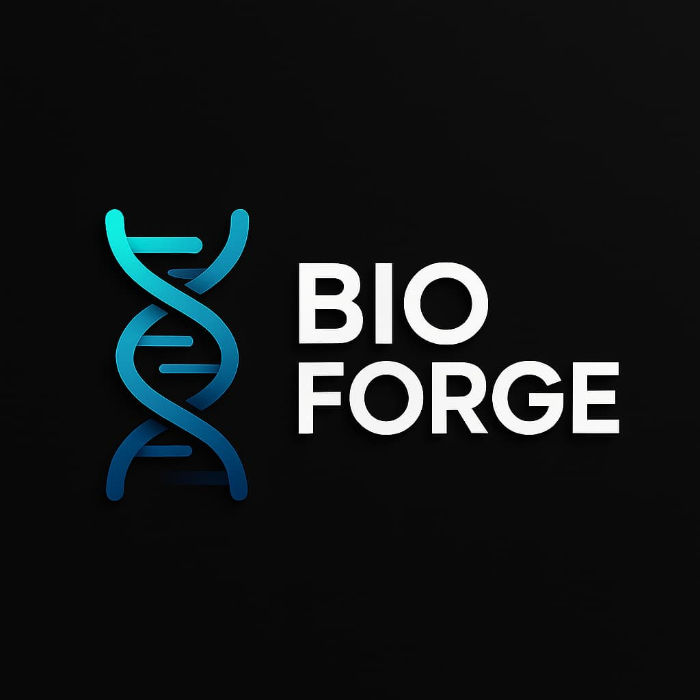
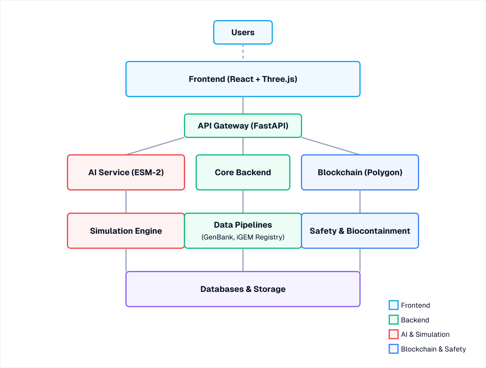

# BioForge: Open-Source No-Code Synthetic Biology Platform

<div align="center">
  
  <p>Design and simulate synthetic organisms to solve global sustainability problems</p>
  
  [](https://opensource.org/licenses/MIT)
  [](https://github.com/Appixia-Softwares/BioForge/stargazers)
  [](https://github.com/Appixia-Softwares/BioForge/issues)
  [](https://github.com/Appixia-Softwares/BioForge/actions)
</div>

## 🧬 Overview

BioForge is a comprehensive open-source no-code synthetic biology platform that empowers scientists, students, and citizen scientists to design, simulate, and share synthetic organisms. Our mission is to democratize synthetic biology and accelerate innovation in addressing global sustainability challenges.

### Key Features

- 🧪 **Intuitive DNA Designer**: Drag-and-drop interface for designing genetic circuits
- 🔬 **AI-Powered Validation**: Advanced AI models to validate and optimize designs
- 🧫 **Simulation Engine**: Test your designs in silico before lab implementation
- 🛡️ **Safety & Biocontainment**: Built-in safety checks and biocontainment strategies
- 📊 **Data Integration**: Seamless integration with GenBank, iGEM Registry, and more
- 🔗 **Blockchain IP-NFTs**: Secure your intellectual property with blockchain technology
- 👥 **Community Collaboration**: Share and collaborate on designs with the community

## 🚀 Getting Started

### Prerequisites

- [Docker](https://www.docker.com/get-started) and [Docker Compose](https://docs.docker.com/compose/install/)
- [Node.js](https://nodejs.org/) (v18 or later)
- [Python](https://www.python.org/) (v3.9 or later)
- [Git](https://git-scm.com/)

### Installation

1. Clone the repository:
   ```bash
   git clone https://github.com/Appixia-Softwares/BioForge.git
   cd BioForge
   ```

2. Set up environment variables:
   ```bash
   cp .env.example .env
   # Edit .env with your configuration
   ```

3. Start the development environment:
   ```bash
   docker-compose -f docker-compose.dev.yml up
   ```

4. Access the application:
   - Frontend: http://localhost:3000
   - API Gateway: http://localhost:8000
   - API Documentation: http://localhost:8000/docs

### Production Deployment

For production deployment, use the production Docker Compose file:

```bash
docker-compose up -d
```

## 🏗️ Architecture

BioForge is built with a microservices architecture to ensure scalability and maintainability:

- **Frontend**: React, Next.js, Three.js
- **API Gateway**: FastAPI
- **AI Service**: ESM-2, PyTorch
- **Blockchain**: Polygon, Solidity
- **Simulation Engine**: Custom simulation algorithms
- **Data Pipelines**: Integration with biological databases
- **Safety & Biocontainment**: Safety validation service



## 🤝 Contributing

We welcome contributions from the community! Please see our [Contributing Guidelines](CONTRIBUTING.md) for more information on how to get involved.

### Development Workflow

1. Fork the repository
2. Create a feature branch: `git checkout -b feature/amazing-feature`
3. Commit your changes: `git commit -m 'Add amazing feature'`
4. Push to the branch: `git push origin feature/amazing-feature`
5. Open a Pull Request

## 📚 Documentation

- [User Guide](docs/user-guide.md)
- [Developer Documentation](docs/developer-docs.md)
- [API Reference](docs/api-reference.md)
- [Design Principles](docs/design-principles.md)
- [Safety Guidelines](docs/safety-guidelines.md)

## 📝 License

This project is licensed under the MIT License - see the [LICENSE](LICENSE) file for details.

## 🙏 Acknowledgements

- [ESM-2](https://github.com/facebookresearch/esm) for protein language models
- [iGEM Registry](https://parts.igem.org/) for biological parts
- [GenBank](https://www.ncbi.nlm.nih.gov/genbank/) for genetic sequences
- [OpenAI](https://openai.com/) for AI research
- [Polygon](https://polygon.technology/) for blockchain infrastructure

## 📧 Contact

- Project Website: [https://appixia-softwares.github.io/BioForge](https://appixia-softwares.github.io/BioForge)
- Email: [info@appixia.com](mailto:info@appixia.com)
- Twitter: [@AppixiaSoft](https://twitter.com/AppixiaSoft)
- Discord: [Join our community](https://discord.gg/appixia)
