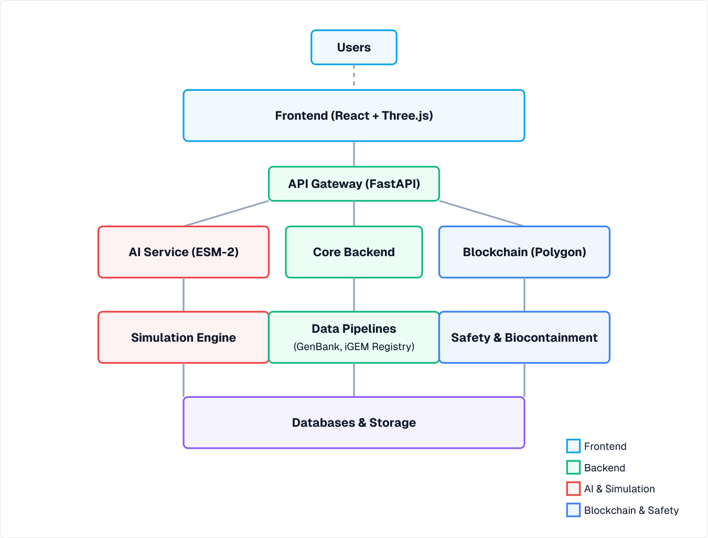

# BioForge Developer Documentation

Welcome to the BioForge developer documentation! This guide will help you understand the architecture of BioForge and how to contribute to its development.

## Table of Contents

1. [Architecture Overview](#architecture-overview)
2. [Development Environment Setup](#development-environment-setup)
3. [Frontend Development](#frontend-development)
4. [Backend Development](#backend-development)
5. [AI Service](#ai-service)
6. [Blockchain Integration](#blockchain-integration)
7. [Simulation Engine](#simulation-engine)
8. [Data Pipelines](#data-pipelines)
9. [Safety Service](#safety-service)
10. [Testing](#testing)
11. [Deployment](#deployment)
12. [API Reference](#api-reference)

## Architecture Overview

BioForge is built with a microservices architecture to ensure scalability and maintainability:

The main components are:

- **Frontend**: React, Next.js, Three.js
- **API Gateway**: FastAPI
- **AI Service**: ESM-2, PyTorch
- **Blockchain**: Polygon, Solidity
- **Simulation Engine**: Custom simulation algorithms
- **Data Pipelines**: Integration with biological databases
- **Safety & Biocontainment**: Safety validation service

## Development Environment Setup

### Prerequisites

- [Docker](https://www.docker.com/get-started) and [Docker Compose](https://docs.docker.com/compose/install/)
- [Node.js](https://nodejs.org/) (v18 or later)
- [Python](https://www.python.org/) (v3.9 or later)
- [Git](https://git-scm.com/)

### Getting Started

1. Clone the repository:
   \`\`\`bash
   git clone https://github.com/bioforge/bioforge.git
   cd bioforge
   \`\`\`

2. Set up environment variables:
   \`\`\`bash
   cp .env.example .env
   # Edit .env with your configuration
   \`\`\`

3. Start the development environment:
   \`\`\`bash
   docker-compose -f docker-compose.dev.yml up
   \`\`\`

4. Access the application:
   - Frontend: http://localhost:3000
   - API Gateway: http://localhost:8000
   - API Documentation: http://localhost:8000/docs

## Frontend Development

The frontend is built with Next.js, React, and Three.js.

### Directory Structure

\`\`\`
frontend/
├── app/             # Next.js app directory
├── components/      # React components
├── hooks/           # Custom React hooks
├── lib/             # Utility functions
├── public/          # Static assets
├── styles/          # Global styles
└── types/           # TypeScript type definitions
\`\`\`

### Key Components

- **DNA Designer**: Interactive canvas for designing genetic circuits
- **3D Viewer**: Three.js visualization of DNA and protein structures
- **Simulation Panel**: Display and configuration of simulation results
- **Safety Panel**: Safety analysis and recommendations
- **Blockchain Integration**: Wallet connection and NFT management

### Development Workflow

1. Make changes to the code
2. Run tests: `npm test`
3. Start the development server: `npm run dev`
4. Access the application at http://localhost:3000

## Backend Development

The backend is built with FastAPI and serves as the API gateway for the microservices.

### Directory Structure

\`\`\`
backend/
├── main.py          # Main application entry point
├── models/          # Data models
├── services/        # Service integrations
├── routes/          # API routes
└── utils/           # Utility functions
\`\`\`

### Key Features

- **Authentication**: Firebase authentication integration
- **API Gateway**: Routes requests to appropriate microservices
- **Data Models**: Pydantic models for DNA designs and parts
- **Service Integration**: Communication with other microservices

### Development Workflow

1. Make changes to the code
2. Run tests: `pytest`
3. Start the development server: `uvicorn main:app --reload`
4. Access the API at http://localhost:8000

## AI Service

The AI service uses ESM-2 for protein structure prediction and function prediction.

### Directory Structure

\`\`\`
ai-service/
├── main.py          # Main application entry point
├── models/          # AI models
├── utils/           # Utility functions
└── tests/           # Tests
\`\`\`

### Key Features

- **Protein Structure Prediction**: ESM-2 based structure prediction
- **Function Prediction**: Predict the function of DNA sequences
- **Sequence Validation**: Validate DNA sequences for issues

### Development Workflow

1. Make changes to the code
2. Run tests: `pytest`
3. Start the development server: `uvicorn main:app --reload --port 8001`
4. Access the API at http://localhost:8001

## Blockchain Integration

The blockchain integration uses Polygon for IP-NFTs.

### Directory Structure

\`\`\`
blockchain/
├── contracts/       # Solidity smart contracts
├── scripts/         # Deployment scripts
├── test/            # Contract tests
└── hardhat.config.js # Hardhat configuration
\`\`\`

### Key Features

- **IP-NFT Contract**: Smart contract for intellectual property NFTs
- **Royalty Distribution**: Automatic royalty distribution to contributors
- **Ownership Verification**: Verify ownership of designs

### Development Workflow

1. Make changes to the contracts
2. Run tests: `npx hardhat test`
3. Deploy to testnet: `npx hardhat run scripts/deploy.js --network mumbai`
4. Verify contracts: `npx hardhat verify --network mumbai CONTRACT_ADDRESS`

## Simulation Engine

The simulation engine predicts the behavior of synthetic biology designs.

### Directory Structure

\`\`\`
simulation-service/
├── main.py          # Main application entry point
├── models/          # Simulation models
├── utils/           # Utility functions
└── tests/           # Tests
\`\`\`

### Key Features

- **Growth Simulation**: Predict growth of the host organism
- **Protein Expression**: Predict protein expression levels
- **Metabolic Pathway Analysis**: Analyze complete metabolic pathways
- **Time Series Data**: Generate time series data for key metrics

### Development Workflow

1. Make changes to the code
2. Run tests: `pytest`
3. Start the development server: `uvicorn main:app --reload --port 8003`
4. Access the API at http://localhost:8003

## Data Pipelines

The data pipelines service integrates with biological databases.

### Directory Structure

\`\`\`
data-pipelines/
├── main.py          # Main application entry point
├── sources/         # Data source integrations
├── utils/           # Utility functions
└── tests/           # Tests
\`\`\`

### Key Features

- **GenBank Integration**: Fetch data from NCBI GenBank
- **iGEM Registry Integration**: Fetch data from the iGEM Registry
- **Data Transformation**: Convert between different data formats
- **Caching**: Cache frequently accessed data

### Development Workflow

1. Make changes to the code
2. Run tests: `pytest`
3. Start the development server: `uvicorn main:app --reload --port 8004`
4. Access the API at http://localhost:8004

## Safety Service

The safety service checks designs for safety concerns.

### Directory Structure

\`\`\`
safety-service/
├── main.py          # Main application entry point
├── models/          # Safety models
├── utils/           # Utility functions
└── tests/           # Tests
\`\`\`

### Key Features

- **Safety Analysis**: Analyze designs for safety concerns
- **Biocontainment Verification**: Verify biocontainment strategies
- **Regulatory Compliance**: Check for regulatory issues
- **Recommendations**: Generate safety recommendations

### Development Workflow

1. Make changes to the code
2. Run tests: `pytest`
3. Start the development server: `uvicorn main:app --reload --port 8002`
4. Access the API at http://localhost:8002

## Testing

BioForge uses a comprehensive testing strategy:

- **Unit Tests**: Test individual functions and components
- **Integration Tests**: Test interactions between components
- **End-to-End Tests**: Test complete user flows
- **Contract Tests**: Test smart contract functionality

### Running Tests

- Frontend: `cd frontend && npm test`
- Backend: `cd backend && pytest`
- AI Service: `cd ai-service && pytest`
- Safety Service: `cd safety-service && pytest`
- Simulation Service: `cd simulation-service && pytest`
- Data Pipelines: `cd data-pipelines && pytest`
- Blockchain: `cd blockchain && npx hardhat test`

## Deployment

BioForge can be deployed using Docker Compose or Kubernetes.

### Docker Compose Deployment

\`\`\`bash
docker-compose up -d
\`\`\`

### Kubernetes Deployment

\`\`\`bash
kubectl apply -f kubernetes/
\`\`\`

### CI/CD Pipeline

BioForge uses GitHub Actions for CI/CD:

1. Code is pushed to GitHub
2. GitHub Actions runs tests
3. If tests pass, Docker images are built
4. Images are pushed to Docker Hub
5. Deployment is triggered

## API Reference

For detailed API documentation, see the [API Reference](api-reference.md) or access the Swagger UI at http://localhost:8000/docs when running the application.
